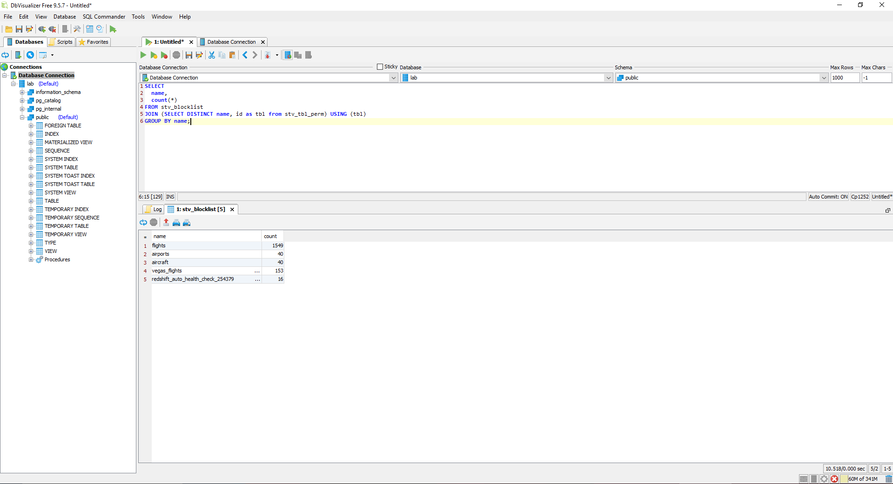

# Redshift to analyze data

The main goal of this lab is to create a Redshift cluster, copy data into the instance, and analyze the data by using SQL commands.

## Redshift - Nodes & Clusters

| Instance Families | Node Types | Storage Types| Storage Per Node | Max Storage |
| ----------------- | :---------:| :-----------:| :--------------: | ----------: |
|Dense Compute	    |dc1.large   |	SSD	        | 0.16TB	       |32 nodes = 5.12TB|
|Dense Compute	    |dc1.8xlarge |	SSD	        | 2.56TB	       |128 nodes = 326TB|
|Dense Storage	    |ds2.xlarge	 |  Magnetic	| 2TB	           |32 nodes = 64TB|
|Dense Storage	    |ds2.8xlarge |	Magnetic	| 16TB	           |128 nodes = 2PB|

## Create a Redshift cluster
* Launch a cluster in the console
  * Cluster Identifier
  * Database Name
  * Database Port
  * Master User Name
  * Master User Password
  * Node Type
  * Cluster Type
  * Number of Compute Nodes
* Configure VPC security group - Redshift

## SQL Client Software
To interact with Redshift by using SQL, I recommend using [dbVisualizer](http://www.dbvis.com), a SQL client that is compatible with PostfreSQL.

## Copy data into the instance

* Create a table by using CREATE command
* Copy data from S3 by using COPY command
* Create tables from other existing tables

## Query the database and anlyze the data
* Running various queries
* Analyze query performances by using EXPLAIN command
* View compression analysis(best way of storing each cols) results by using ANALYZE COMPRESSION command
* View disk space & data distribution

