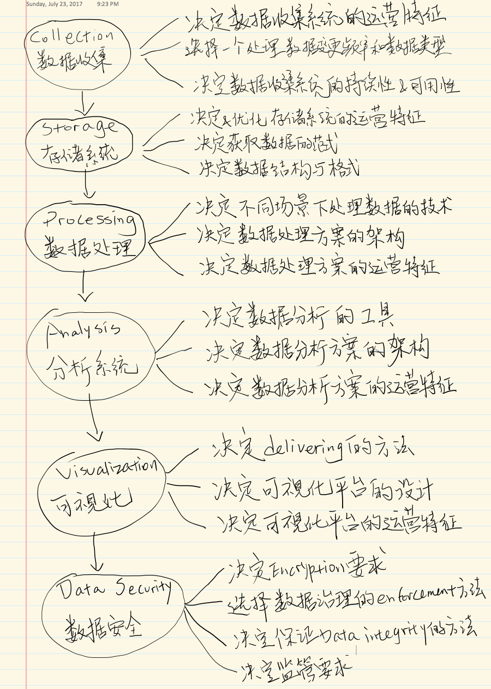

# Big Data Topics

## Big Data Abstraction

The following is an abstraction of Big Data Application Process in AWS(in Chinese):

## Big Data WorkFlow

## Big Data Services

* General Big Data Technology: Concepts of Map Reduce, Data Shuffling, Performance Tuning & Security.
  * HDFS vs EMRFS , when to use it
  * Have a HIGH LEVEL understanding of Spark, Spark Straming, Presto & Zeppelin
  * Hbase & Hive usages

* **Kinesis** Stram & Firehose: Big Data Ingestion & Streaming
  * How to tune the throughput & troubleshoot PRODUCER & CONSUMER theoughput issues
  * Know features by KPL & KCL
  * Know why ingestion using Kinesis is better than Kafka
  * Know Limitation of Kinesis Stream on storage duration
  * Know how sharding affects throughput
 
* **Redshift** 
  * Understand the overall architecture(leader/compute node/node slices).
  * Understand workload management & when to use it to cater to different types of queries
  * Understand how encryption can be applied to Redshift data using KMS & CloudHSM
  * Know how to import data into Redshift(COPY) & move/migrate data to S3(UNLOAD)
  * Know how to tune performance by selecting right sort key & dist stule for dimension & fact tables
  * Know how to secure data in transit using SSL
  
* **DynamoDB**
  * Understand right use case for DynamoDB
  * Understand how partition affects query performance
  * Understand how to select the right hash & sort key for given situation
  * Understand how to design the right LSI & GSI for optiomal throughput
  * Understand how to troubleshoot data throttling issues due to GSI & LSI design
  * Understand the impact of partitioning on WCU & RCU (hot partitions)
  * Understand limitation of DynamoDB (item size & how to overcome it)
  
* AWS IoT
  * Understand Device Gateway, IoT Rules, Device Registry & Device Shadow
  
* AWS EMR
  * Understand advantages of using EMR with S3
  * Understand when to use core node vs task node
  * Understand EMRFS vs HDFS
  * Understand why running map reduce using S3 might be sometimes better than HDFS approach or vice versa
  
* Machine Learning
  * Know the various types of models supported by AWS Machine Learning
  * Know when to select the right model for the specific business scenario
  * If the mode is NOT supported in AML, Spark MLib might be the right choice
  
* Data Visualization
  * Know general features of QuickSight & how it is compared to others such as Tableau
  * Understand what is the quickest way to explore data generated from EMR, using Zeppelin.

* Security
  * Understand IAM roles, HSM, data encryption support for S3, Redshift and DynamoDB
  
* **S3**
  * **Key Areas:** Data ingestion storage & storing EMR results after ETL processing
  * Understand how to import data from S3 to Redshift for analysis
  
* Data Pipeline
  * Backup & restore of data into other AWS regions.

## Labs for beginners
  * [Create an Amazon DynamoDB as a web app database support](https://github.com/emoffee/Hyonotes/tree/master/AWS/BigDataSpecialty/Labs/DynamoDB_for_webapp)

## Labs for intermediate users
  * Use Kinesis Firehose and Kinesis Stream to capture and process streaming data
  * Use Kinesis to analyze a website viewer's data
  * Apply encryption, versioning, and lifecycle policies on files in S3
  * Analzye Facebook metrics from a large cosmetics company using Amazon Machine 

## Projects
### AWS Projects
  * Create Sentiment Analysis(SA) over Chinese Stock market with WeiBo data
  * Crate a Web Server Log Analysis
  * Extend the data source for SA and Create a petabyte-scale data warehouse service
  * Create first real-time big data stream
  * Deploying Cloudera's Enterprise Data Hub on AWS
  * Deploying a MongoDB cluster on AWS
  * Build a data lake on AWS

### My Personal Project
  * Stream my self-driving car's data for analysis