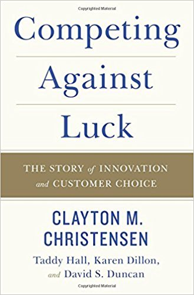

# Competing Against Luck: The Story of Innovation and Customer Choice
## Notes & Review in Chinese

## Introduction：Why you should hire this book? 雇佣本书为哪般

> 大数据时代，有些傻逼到处宣称相关性（correlation）才是王道（是不是想起了沃尔玛啤酒和尿不湿的烂故事？）。但相关性到底有多大的用处，我真他妈的怀疑。

> 我相信，真正的创新是可预测的，如果你认为创新是小步快跑的话。

> 好的理论告诉你How和why, 甚至是这个世界的某个方面如何运行以便得以良好的预测。

## Chapter 1： The Milk Shake Dilemma 奶昔困境

> 问题的提出，How do successful companies know how to grow?

> 当我(The Author)思考如何为一家成功的奶昔餐馆提高销量，我一开始用了一个传统而愚蠢的办法：询问客户各种细节如何让他们购买更多的奶昔（IFG）。比如这样问，"您认为我们该如何做您才愿意多买我们的奶昔？更便宜，更有口感或是更漂亮的杯子？通过几个月的努力，我们惊人的发现：我们还是tm不知该怎么做。后来我换了一种角度来看这个命题：到底是人们生活中出现了怎样的问题（job）使得人们愿意去餐馆‘雇佣’（hire）这些奶昔来解决这些的?(I wonder what job arises in people lives that causes them to come to this restaurant to 'hire' a milk shake?)

> 客人们绝壁不是仅仅买一个产品，而是‘雇佣’这个产品来帮他们干一个特定的活儿(perform a specific job). 每天游离在各种场景各种角色中的我们都会遇到各种麻烦事儿，所以我们就需要‘雇佣’一些产品来搞定他们(We all have jobs we need to do that arise in our day-to-day lives and when we do, we hire products or services to get the job done.)

> 一个产品很大程度上要应付n多种不同的活儿（job），不同的活儿有其完全不同的场景，在不同的场景里要对付的对手又完全不同：对于一个早上要花20分钟通勤上班的人，一路上的无聊会让他很容易放弃啃一个几口就啃完的香蕉或是搞得满手是油的炸薯饼，而在车上嘬20分钟沙冰来消磨时光真是一个不错的主意；但对一个下午5点接孩子放学的一贯严厉的老父亲来说，选择一杯不那么健康但却讨孩子欢心的沙冰，或许比去隔壁玩具店更能缓解他对孩子的愧疚感。

> 活儿（job）这个角度很快让传统的办法IFG显得的很二。同不同意？

 就像我(Tong)自己玩江湖侠客令（金庸群侠传）这个其实很无聊的手游，原因很简单：

 - 我想看看国内的手游到底是个什么盈利模式，什么游戏范式，跟单机时代的游戏模式到底有哪些区别；

 - 最近我发现游戏是个人生高度仿真的场景（RMB玩家把免费玩家纯粹当福利，这不就是人生么），我玩纯粹是思考人生；

 - 大家都tm讨厌人民币玩家，有没有什么办法对抗他们？我想试试。

 - 吸引我最初选择她的原因是，我看到她被金庸的律师告了，说是侵权。我最喜欢黄蓉了。每一版射雕老子都看。

 最后，我惊人花了快100美金来玩。现在以每天花一刀的速度攒资源。靠，人民币玩家。我的结论就是，要打败人民币玩家，一定要舍得花美金。

> 如果以上的分析都成立的话，那我们是不是应该把产品当作一个找工作的人（job seeker）了？对于找工作的人来说，第一件事情肯定是写简历啦。

> 来来来，我们来玩个游戏：想想该怎么给我的沙冰写一份简历？

> 我二十年前第一次跟联合利华的老总谈应用这个理论来解决玛格丽塔的销售问题，他蒙圈地表示很搞笑。我想，他们可能习惯了使用各种与产品质量，客户满意度直接相关的具体指标（metrics）来思考销售问题，
而忽视了那些怎么把活干好(get job done)的维度（是不是这么说太抽象了？）。当然，也可能是我心急吃不了热豆腐，用词用句太过急躁所以表达不准确，导致这货没理解吧。

> 经过快二十年对玛格丽塔市场的观察，我的结论是，那个老总是个傻逼。

> 成功的创新者总是用比平常人多的多的角度来看待商业问题。别呵呵，真是这样。

## Chapter 2

>  巴斯（就是消毒牛奶的巴氏消毒的那位）是最伟大的科学家之一.这不仅仅因为他让我们喝上了更干净的牛奶，而是因为他的研究方法是开创性的。

## Chapter 3： Jobs in the wilds 荒野求存

SNHU的故事

FranklinCovey的故事

Intuit(Quickbook)的故事

> Intuit的团队搞清楚了任务(Task)和在某种情境中挣扎(a genuine struggle in specific circumstances)的根本区别。好多用财务软件的小企业主压根儿就不知道也不想搞清楚那些晦涩的会计准则是个什么鬼，他们关心的只有一件事：以最简单最快速的方式收钱和花钱。

> 然而QB的竞争者把会计软件搞的越来越复杂，越来越恶心，客户们必须考虑要么招一个能玩转这些变态软件的会计，或者碰运气找个无所不能的会计自己搞。

> 在你们的眼里，Quickbook不可能成功。与同类专(bian)业(tai)会计软件相比，QB只有他们一半的功能却比他们贵一倍。可是你们too simple, too naive.QB很快久成了在线会计软件的全球老大。为毛打脸打的这么狠？恐怕是因为，他的竞争者只想做最好的会计软件，而QB只关心能为客户干什么样的活儿(jobs)

> QB的老板Cook傲娇地说，我们只关心如何把在水深火热中的客户拯救出来，对别的真没兴趣(All that we do is focus on solving the customers' struggle. That's all we do and the only thing we do)

> Jobs Thoery的要义是，寻求创新与成长的组织需要从根本上改变他们热衷于提升产品质量（或者那种热衷于开发炫酷吊炸天产品的公司）而不是帮客户解决问题的方式。关心产品其实没有什么错，但是这个逻辑的背面是，产品质量的提升并不必然导致客户掏钱买单。想让这帮铁公鸡掏钱，前提是解决他们面临的实实在在的问题(get job done)，不管你的产品看起来多么土,技术多么渣(是不是想到MongoDB和RethinkDB的故事了？）

> 就跟泡妞一样，如果不在你女朋友的闺蜜面前秀恩爱／秀大方／秀温柔，长得帅有个毛用，有钱有个毛用。
