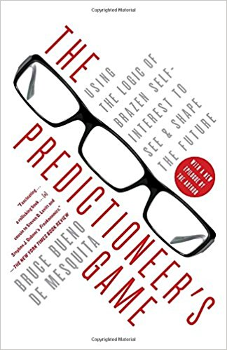
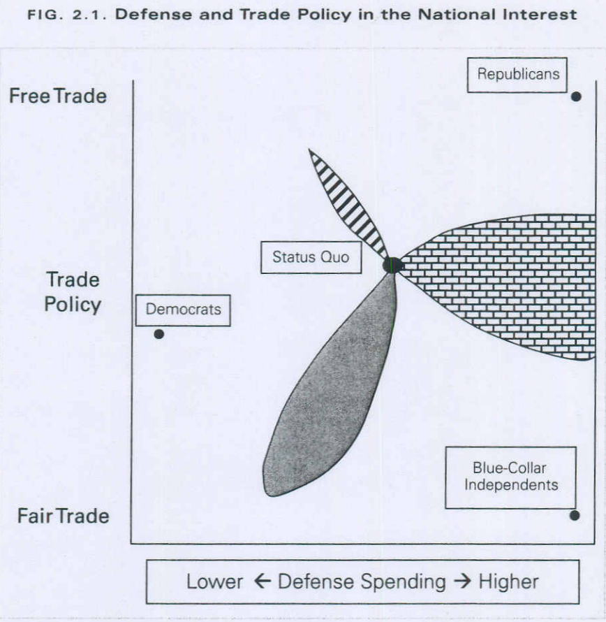

# The Predictioneer's Game

* 我们是有可能与其行为，预测未来的；通过寻找改变激励的办法，我们可以利用于人类决策相关的一系列巧妙的办法来设计，改造未来。
* 博弈论的核心是将人们视为冷酷无情，自私自利的动物。也就是说，诺言在博弈中并不可信，欺骗才是策略的一部分。当然，人们知道欺骗是要付出代价的。所以它们会讲预期的成本和收益一并纳入考虑。一句话，人们的行为必须和其利益在逻辑上保持一致。

* 博弈论思考方式的本质是，人们在互动过程中会采用策略。一个成功的预测者，最重要的一点是要考虑到他人如何考虑它们的问题。
* 博弈论要求我们在表达与理解自己和他人的偏好上要格外小心。
* 国家领导人应该用什么政策来保护国家福祉？将任何政策称为促进或者违背国家利益，居然都是合理的，或者能让它看起来是合理的。下面这个图，起码说明了一个有趣的观察，有许多种不同的国防开支和贸易政策组合可以让大多数人组成不同形式的联盟受益。我们难以将国家利益用多数人支持的事物来定义，它并不是客观评价的结果，而只是情人眼里出西施而已。从这个角度去看，任何为国家利益赋予的情绪，不论亢奋还是深沉，都只是让它看起来更加合理一下罢了。

* 议程控制(Agenda Control)，也就是确定决策顺序的过程，可能会决定一切。这很容易理解，议程控制实际上就是静悄悄的向有利于我们的方向改变了游戏规则。
* 定义好问题，问题就解决了一半。
* 我们永远不能只停留在抽象层面进行预测和做决策。
